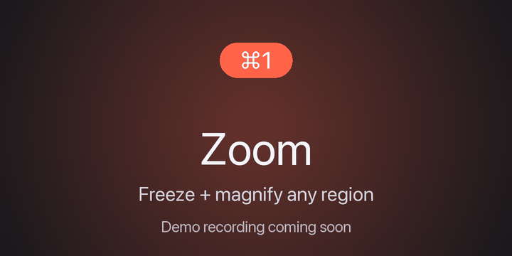
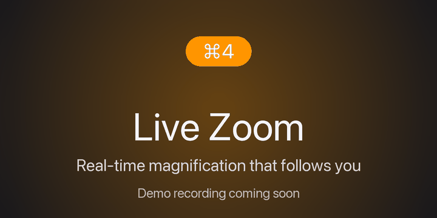
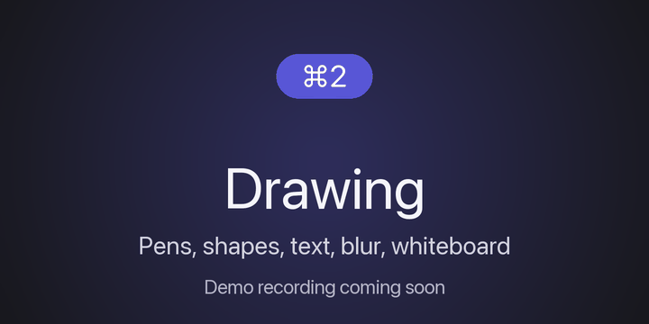
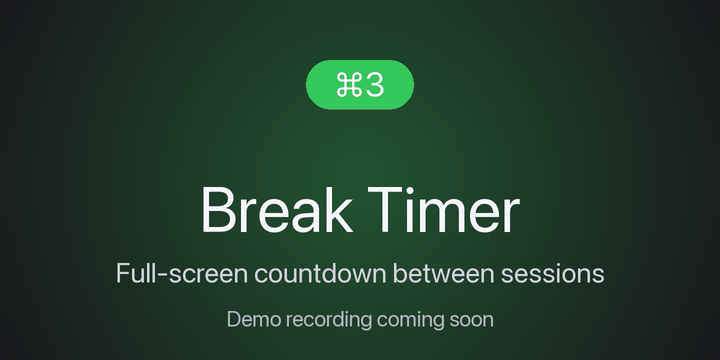
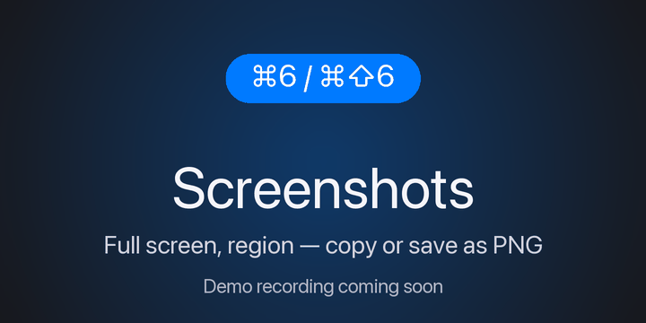
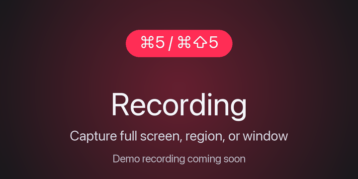

# MacZoomer

A native macOS screen-zoom, annotation, screenshot, and recording tool for technical presentations and demos. Inspired by [Sysinternals ZoomIt](https://learn.microsoft.com/sysinternals/downloads/zoomit) — reimplemented from scratch for macOS.

> **Status:** 🛠 Pre-release. Zoom, Live Zoom, Drawing, Screenshots, and the Break Timer are functional. Screen Recording is functional in dev (⌘5 verified). Notarized distribution is blocked on Apple Developer ID enrollment — see [docs/demos/](docs/demos/README.md) for the demo-recording workflow.

## Features

| Feature | Default shortcut | Status |
| --- | --- | --- |
| Zoom Mode (freeze + magnify) | ⌘1 | ✅ |
| Drawing & Annotation (pens, highlighter, blur, shapes, text, whiteboard) | ⌘2 | ✅ |
| Break Timer (full-screen countdown) | ⌘3 | ✅ |
| Live Zoom (real-time magnification with pan) | ⌘4 | ✅ |
| Live Draw (annotate the live desktop) | ⌘⇧4 | ✅ |
| Copy / save full screen or region as PNG | ⌘6 / ⌘⇧6 / ⌘⌃6 / ⌘⇧⌃6 | ✅ |
| Screen Recording (MP4) | ⌘5 / ⌘⇧5 / ⌘⌥5 | 🧪 in dev |
| Auto-update via Sparkle + signed/notarized DMG | — | ⏳ blocked on Developer ID |

Every shortcut is rebindable in Settings → Hotkeys. Settings can be exported/imported as JSON.

Out of scope for v1: OCR, DemoType, panorama recording, audio in recordings (deferred to v1.1).

## Demos

Animated walkthroughs of each feature. Captured with MacZoomer's own recording mode, then converted to GIF via [`scripts/mp4-to-gif.sh`](scripts/mp4-to-gif.sh). See [docs/demos/README.md](docs/demos/README.md) for how to regenerate or contribute new ones.

### Zoom — freeze the screen and magnify (⌘1)



### Live Zoom — real-time magnification that follows the cursor (⌘4)



### Drawing & Annotation — pens, shapes, text, blur, whiteboard (⌘2)



### Break Timer — full-screen countdown for breaks between demos (⌘3)



### Screenshots — full screen, region, copy or save (⌘6 / ⌘⇧6 / ⌘⌃6 / ⌘⇧⌃6)



### Screen Recording — full screen, region, or single window to MP4 (⌘5 / ⌘⇧5 / ⌘⌥5)



## Requirements

- macOS 14 Sonoma or newer
- Apple Silicon or Intel Mac
- Screen Recording permission (granted on first use; needed for zoom, screenshots, and recording)

## Building from source

```sh
# Install build tools (one-time)
brew install xcodegen

# Generate the Xcode project
make generate

# Build & run via Xcode
open MacZoomer.xcodeproj

# OR build via SwiftPM (no Xcode needed for compile-checking)
swift build
```

A signed Release `.app` for local installation:

```sh
xcodebuild -project MacZoomer.xcodeproj -scheme MacZoomer -configuration Release \
  -derivedDataPath build CODE_SIGN_IDENTITY="-" CODE_SIGNING_REQUIRED=NO \
  CODE_SIGNING_ALLOWED=NO build

codesign --force --deep --sign - \
  --identifier com.markusbosch.MacZoomer --options runtime \
  --entitlements Sources/MacZoomer/Resources/MacZoomer.entitlements \
  build/Build/Products/Release/MacZoomer.app

cp -R build/Build/Products/Release/MacZoomer.app /Applications/
```

Full Developer ID signing, notarization, and DMG packaging will be wired into a GitHub Actions release workflow before v1.0.

## Permissions

MacZoomer requests **Screen Recording** the first time you trigger an action that needs it. The grant only takes effect after the app is fully quit and relaunched (a macOS requirement, not a MacZoomer choice).

If you build from source, every fresh build produces a new code-signing hash, which invalidates the previous grant. Use `tccutil reset ScreenCapture com.markusbosch.MacZoomer` to start fresh.

## License

[MIT](LICENSE) © 2026 Markus Bosch

